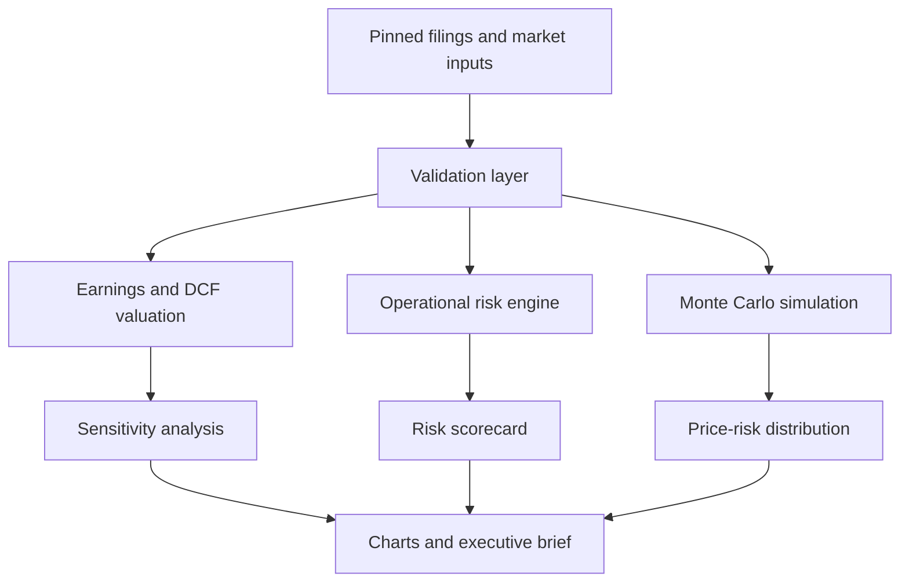

# Gap Equity and Operational Risk Model

An analyst-grade, reproducible equity research pipeline for **Gap Inc. (NYSE: GAP)**. The project connects conventional valuation to the operational risks that can move an apparel retailer's stock price: tariffs, sourcing concentration, consumer demand, brand execution, promotional intensity, inventory, logistics, fixed lease commitments, and capital allocation.

The model is designed as a decision-support and portfolio-research project. It is not investment advice.

## Current research thesis

Gap is an inexpensive but operationally sensitive turnaround. The Gap brand has strong momentum, the balance sheet has net cash before leases, and the company continues to return capital. Those positives are offset by four material questions:

1. Can a 7% or better operating margin survive tariff and promotional pressure?
2. Can Old Navy sustain growth when value-conscious consumers are under pressure?
3. Can Athleta stop contracting?
4. Are repurchases being funded by durable free cash flow or temporary balance-sheet capacity?

The model turns those questions into explicit valuation scenarios, risk scores, and simulated equity-value distributions.

## Reference results

The validated July 30, 2026 pinned run produced:

| Metric | Result |
| --- | ---: |
| Reference price | $20.38 |
| Forward P/E | 8.67x |
| Composite operational-risk score | 73.2/100 |
| Risk-weighted fair value | $22.80 |
| Monte Carlo median | $21.64 |
| Probability above reference price | 58.3% |
| Monte Carlo 5th-95th percentile range | $13.02-$32.94 |

[View the validated pinned executive brief](docs/gap_equity_operational_risk_brief_pinned_2026-07-30.pdf).

## What the pipeline produces

- Pinned or optional live Gap market-price snapshot
- Forward P/E and balance-sheet diagnostics
- Bear, base, and bull earnings valuations
- Five-year discounted cash-flow valuations
- Probability-weighted blended fair value
- Operating-margin and P/E sensitivity heatmap
- Eight-factor operational-risk scorecard
- Brand-level comparable-sales analysis
- Vietnam and Indonesia sourcing-concentration analysis
- Seeded Monte Carlo simulation with tariff, consumer, and brand shocks
- Six publication-ready charts
- A multi-page executive PDF research brief
- Machine-readable analyst outputs in CSV format

## Model architecture



## Quick start

### Windows PowerShell

```powershell
cd gap-equity-operational-risk-model
py -m venv .venv
.\.venv\Scripts\Activate.ps1
python -m pip install -r requirements.txt
python main.py
```

### macOS or Linux

```bash
cd gap-equity-operational-risk-model
python3 -m venv .venv
source .venv/bin/activate
python -m pip install -r requirements.txt
python main.py
```

The default run uses the pinned July 30, 2026 market snapshot so results remain reproducible.

To attempt a current price refresh:

```bash
python main.py --live
```

If the market-data request or `yfinance` is unavailable, the pipeline safely falls back to the pinned price and labels the output `pinned_fallback`.

To change simulation size or seed:

```bash
python main.py --simulations 50000 --seed 2026
```

## Tests

The test suite uses Python's standard-library test runner:

```bash
python -m unittest discover -s tests -v
```

The v1.0.1 release contains nine tests. GitHub Actions repeats the suite on
Python 3.11 through 3.14 and runs a pinned end-to-end smoke test.

## Outputs

After a successful run:

```text
output/
└── pdf/
    └── gap_equity_operational_risk_brief.pdf

outputs/
├── charts/
│   ├── brand_performance.png
│   ├── monte_carlo_distribution.png
│   ├── operational_risk_matrix.png
│   ├── scenario_valuation.png
│   ├── sourcing_concentration.png
│   └── valuation_sensitivity.png
└── data/
    ├── monte_carlo_simulations.csv
    ├── monte_carlo_summary.csv
    ├── risk_scorecard.csv
    ├── scenario_valuations.csv
    └── valuation_sensitivity.csv
```

## Valuation methodology

### Earnings valuation

For each scenario:

```text
Revenue = FY2025 revenue × (1 + scenario growth)
Operating income = Revenue × scenario operating margin
Net income = (Operating income + net interest income) × (1 - tax rate)
EPS = Net income ÷ diluted shares
Earnings value = EPS × scenario P/E
```

### DCF valuation

The model projects five years of scenario-specific free cash flow, discounts those cash flows and a Gordon-growth terminal value, adds net cash, and divides by diluted shares.

The final scenario value uses:

- 70% earnings valuation
- 30% DCF valuation

The overall fair value is probability weighted across bear, base, and bull cases.

### Margin materiality

At approximately $15.6 billion of guided revenue, a 100-basis-point operating-margin change represents about $156 million of pre-tax operating income. The pipeline translates that into after-tax EPS and estimated price sensitivity.

## Monte Carlo methodology

The simulation varies:

- Revenue growth
- Operating margin
- Tax rate
- Net interest income
- Diluted share count
- Forward P/E multiple

It also introduces discrete events:

- Tariff shock: margin penalty
- Consumer slowdown: revenue-growth penalty
- Brand-recovery upside: revenue and margin benefit

The random seed is fixed by default, making every standard run reproducible.

## Updating the model

After each earnings release:

1. Update `data/pinned/financial_snapshot.csv`.
2. Update brand sales and comparable sales in `brand_performance.csv`.
3. Review assumptions and probabilities in `valuation_scenarios.csv`.
4. Reassess likelihood, impact, velocity, and controllability in `risk_inputs.csv`.
5. Update `source_register.csv`.
6. Run the tests and full pipeline.

Do not overwrite historical assumptions without recording the new `as_of` date.

## Data governance

- Pinned inputs are transparent CSV files.
- All scenario probabilities must sum to 1.0.
- The pipeline fails when required inputs or columns are missing.
- Live market data never silently replaces financial-statement assumptions.
- Monte Carlo output is reproducible from its seed.
- Source URLs and dates appear in the executive report.
- Nonrecurring Q1 fiscal 2026 settlement effects are excluded from the forward earnings valuation.

## Principal limitations

- The model estimates one-year equity value, not daily trading prices.
- DCF results are sensitive to normalized free cash flow, discount rate, and terminal growth.
- P/E comparisons across retailers may be distorted by business mix and nonrecurring items.
- Tariff rates and sourcing exposure can change faster than quarterly filings.
- Scenario probabilities and simulation distributions are analyst assumptions.
- The model does not constitute a recommendation to buy, sell, or hold securities.

## Primary sources

- [Gap Q1 fiscal 2026 results](https://investors.gapinc.com/press-releases/news-details/2026/Gap-Inc--Reports-First-Quarter-Fiscal-2026-Results-Raises-Full-Year-Earnings-Per-Share-Outlook/default.aspx)
- [Gap fiscal 2025 results](https://investors.gapinc.com/press-releases/news-details/2026/Gap-Inc--Reports-Fourth-Quarter-and-Fiscal-2025-Results-Provides-Fiscal-2026-Outlook/default.aspx)
- [Gap fiscal 2025 Form 10-K](https://www.sec.gov/Archives/edgar/data/39911/000162828026018573/gap-20260131.htm)
- [Gap Q1 fiscal 2026 Form 10-Q](https://www.sec.gov/Archives/edgar/data/39911/000162828026039070/gap-20260502.htm)
- [Gap investor relations stock information](https://investors.gapinc.com/stock-information/default.aspx)

## Author

Developed as an applied finance and operational-risk intelligence portfolio project for Jason Keen.
